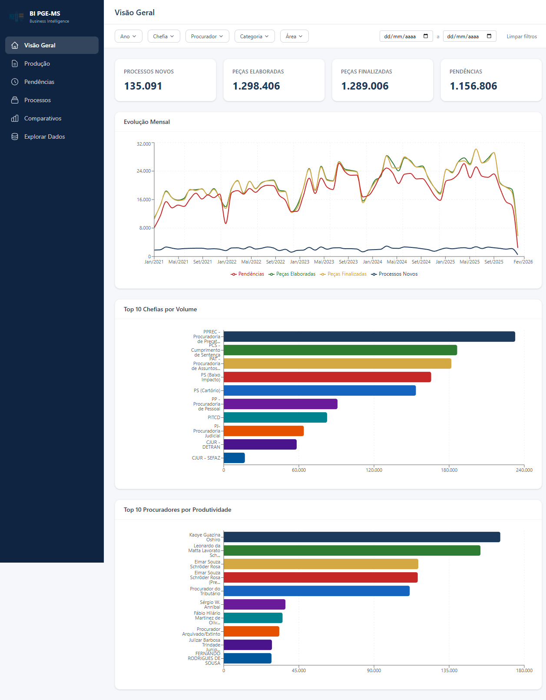

# BI PGE-MS

Dashboard de **Business Intelligence** da Procuradoria-Geral do Estado de Mato Grosso do Sul.

Sistema web para visualizar e analisar dados de produtividade jurídica: processos novos, pecas elaboradas e finalizadas, pendencias, rankings por procurador/chefia/categoria e comparativos entre periodos.



---

## Stack Tecnologica

### Backend
- **Python 3.13** + **FastAPI** (async)
- **SQLAlchemy 2.0** com driver **asyncpg**
- **Pydantic v2** para validacao de dados
- **PostgreSQL** como banco de dados

### Frontend
- **React 19** + **TypeScript**
- **Vite 7** como bundler
- **TailwindCSS v4** para estilizacao
- **Recharts** para graficos
- **TanStack Query** para cache de requisicoes
- **TanStack Table** para tabelas paginadas
- **Zustand** para gerenciamento de estado global

---

## Estrutura do Projeto

```
bi-pge-ms/
├── backend/
│   ├── src/
│   │   ├── main.py              # Entry point FastAPI
│   │   ├── config.py            # Configuracoes (env vars)
│   │   ├── database.py          # Engine async SQLAlchemy
│   │   ├── dependencies.py      # Injecao de dependencias
│   │   ├── domain/              # Modelos, schemas, filtros
│   │   ├── repositories/        # Acesso a dados (queries)
│   │   ├── services/            # Logica de negocio
│   │   └── routers/             # Endpoints da API
│   ├── scripts/                 # Scripts utilitarios
│   └── requirements.txt
├── frontend/
│   ├── src/
│   │   ├── pages/               # Paginas (Overview, Producao, etc.)
│   │   ├── components/          # Componentes reutilizaveis
│   │   ├── api/                 # Cliente HTTP e hooks
│   │   ├── stores/              # Zustand stores
│   │   ├── types/               # Tipos TypeScript
│   │   └── utils/               # Formatters, helpers
│   ├── public/                  # Arquivos estaticos
│   └── package.json
├── Dockerfile                   # Build multi-stage (Node + Python)
├── railway.toml                 # Configuracao Railway
├── .env.example                 # Variaveis de ambiente exemplo
└── README.md
```

---

## Funcionalidades

| Pagina | Descricao |
|---|---|
| **Visao Geral** | KPIs principais, timeline mensal, resumo consolidado |
| **Producao** | Pecas elaboradas vs finalizadas, rankings por procurador/chefia/categoria |
| **Pendencias** | Total de pendencias, obrigatorias vs opcionais, evolucao temporal |
| **Processos** | Processos novos, distribuicao por periodo e chefia |
| **Perfil Procurador** | Metricas individuais de cada procurador |
| **Perfil Chefia** | Metricas agregadas por chefia/coordenadoria |
| **Comparativos** | Comparacao entre procuradores dentro de uma chefia |
| **Explorar Dados** | Consulta direta as tabelas com filtros e exportacao |
| **Admin** | Upload de planilhas, gerenciamento de papeis |

### Filtros Globais
Todas as paginas compartilham filtros globais: **ano**, **mes**, **periodo personalizado**, **chefia**, **procurador**, **categoria** e **area**.

---

## Banco de Dados

PostgreSQL com 4 tabelas principais:

| Tabela | Registros | Descricao |
|---|---|---|
| `processos_novos` | ~135k | Processos distribuidos |
| `pecas_elaboradas` | ~1.3M | Documentos juridicos elaborados |
| `pecas_finalizadas` | ~1.29M | Documentos finalizados |
| `pendencias` | ~1.15M | Tarefas pendentes |

Chave de ligacao: `numero_processo` (entre todas as tabelas).

---

## Desenvolvimento Local

### Pre-requisitos
- Python 3.10+
- Node.js 20+
- PostgreSQL 14+

### Configuracao

1. Clone o repositorio:
```bash
git clone https://github.com/kfrfrancisco/bi-pge-ms.git
cd bi-pge-ms
```

2. Crie o arquivo `.env` na raiz:
```bash
cp .env.example .env
# Edite com suas credenciais do PostgreSQL
```

3. Instale as dependencias do backend:
```bash
cd backend
pip install -r requirements.txt
```

4. Instale as dependencias do frontend:
```bash
cd frontend
npm install
```

### Executar

**Backend** (porta 8001):
```bash
cd backend
python -m uvicorn src.main:app --host 0.0.0.0 --port 8001 --reload
```

**Frontend** (porta 5173):
```bash
cd frontend
npm run dev
```

Acesse:
- **Frontend**: http://localhost:5173
- **API (Swagger)**: http://localhost:8001/docs
- **Health check**: http://localhost:8001/api/health

---

## Deploy no Railway

### 1. Criar projeto no Railway

Acesse [railway.com](https://railway.com) e crie um novo projeto a partir do repositorio GitHub.

### 2. Adicionar banco PostgreSQL

No painel do Railway, clique em **"+ New"** > **"Database"** > **"PostgreSQL"**.

O Railway vai gerar automaticamente a variavel `DATABASE_URL`.

### 3. Configurar variaveis de ambiente

No servico da aplicacao, adicione:

| Variavel | Valor |
|---|---|
| `DATABASE_URL` | *(gerada automaticamente pelo addon PostgreSQL)* |
| `ADMIN_PASSWORD` | Sua senha de admin |
| `CORS_ORIGINS` | `["https://seu-app.up.railway.app"]` |
| `PORT` | `8001` |

### 4. Deploy

O Railway detecta o `railway.toml` e usa o `Dockerfile` multi-stage para:
1. Buildar o frontend (Node 22)
2. Instalar dependencias Python
3. Copiar o frontend buildado para servir como arquivos estaticos
4. Iniciar o Uvicorn

### 5. Gerar dominio

No painel do servico, clique em **"Settings"** > **"Networking"** > **"Generate Domain"**.

---

## Arquitetura

```
┌─────────────┐     ┌──────────────┐     ┌────────────┐
│   Frontend   │────▶│   Backend    │────▶│ PostgreSQL │
│  React SPA   │     │   FastAPI    │     │   pge_bi   │
│  port 5173   │     │  port 8001   │     │  port 5432 │
└─────────────┘     └──────────────┘     └────────────┘
      │                    │
      │  /api/*            │  SQLAlchemy async
      │  (proxy)           │  (asyncpg)
      ▼                    ▼
   Vite Dev Server    Uvicorn ASGI
```

Em produção, o backend serve o frontend buildado como arquivos estaticos (SPA fallback).

---

## API

Todos os endpoints da API estao sob o prefixo `/api/`. Documentacao interativa disponivel em `/docs`.

### Principais endpoints

| Metodo | Rota | Descricao |
|---|---|---|
| GET | `/api/health` | Health check |
| GET | `/api/filters/options` | Opcoes dos filtros globais |
| GET | `/api/dashboard/kpis` | KPIs da visao geral |
| GET | `/api/producao/kpis` | KPIs de producao |
| GET | `/api/producao/timeline` | Serie temporal de producao |
| GET | `/api/pendencias/kpis` | KPIs de pendencias |
| GET | `/api/processos/kpis` | KPIs de processos |
| GET | `/api/comparativos/chefia` | Comparativo por chefia |
| GET | `/api/explorer/schemas` | Schemas das tabelas |
| POST | `/api/admin/upload` | Upload de planilhas |

---

## Licenca

Projeto interno da **PGE-MS** — Procuradoria-Geral do Estado de Mato Grosso do Sul.
